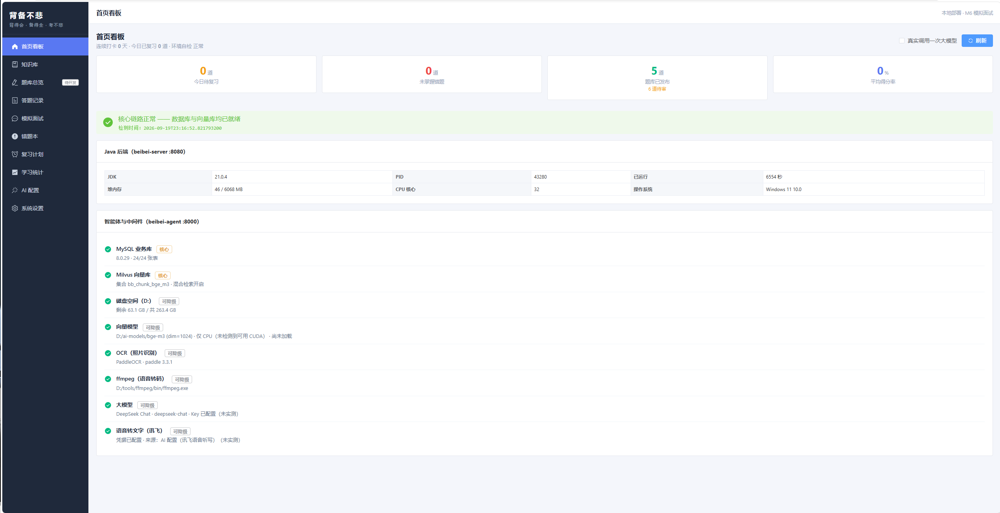
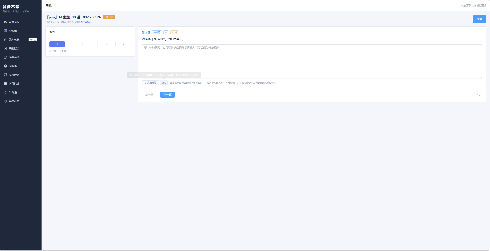
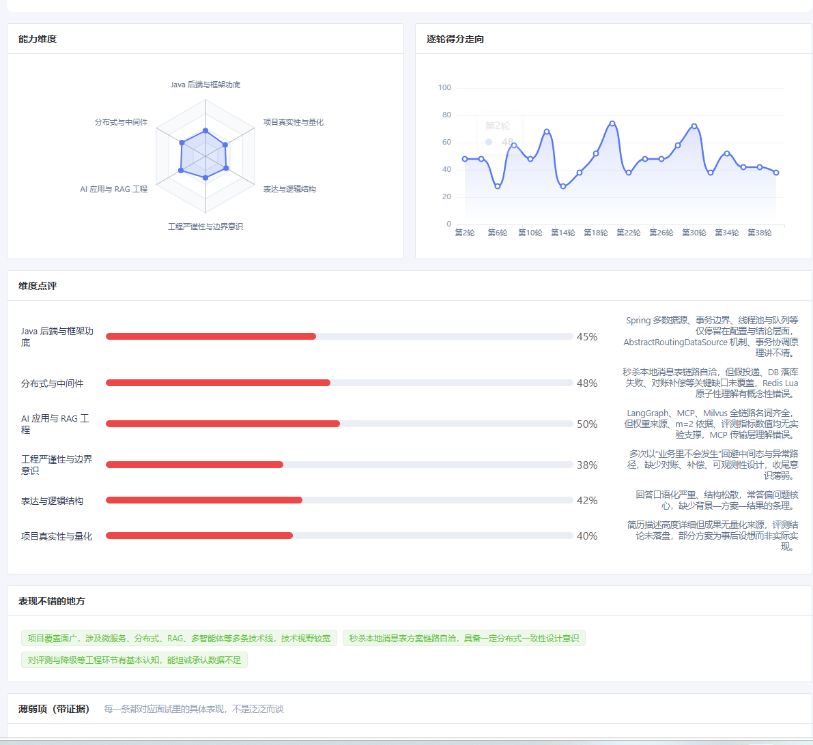

# 背备不悲 · BeiBeiBuBei

> **背**得会 · **备**得全 · **考**不悲

本地部署的 AI 学习工具。上传资料 → 自动建 RAG 知识库 → AI 按知识点出题 → 语音作答 →
AI 按要点判分并溯源 → 错题按艾宾浩斯曲线复习。

**外加一件事**：让 AI 拿你的简历来面试你——多轮追问、五维打分、出评估报告，
最后把报告里的薄弱知识点变成一张专项题卷，回到学习模块接着刷。

<sub>仓库：<https://github.com/Bandit-haoke/beibeibubei> · 反馈：wen_jie_you@163.com</sub>

[功能全景](docs/功能介绍.md) · [部署文档](docs/部署文档.md) · [设计文档](docs/01-设计文档.md) · [踩坑记录](docs/05-进度与验证记录.md)

---

## 它跟「AI 出题工具」的区别

大部分工具只做前半段：把资料变成题。但这个工具想解决三个**断点**：

| 断点 | 表现 | 本工具 |
|---|---|---|
| 资料进不去脑子 | 资料躺在硬盘里 | RAG 知识库 + 知识点树 + 按点出题 |
| **背会了但讲不出来** | 题能刷对，一开口就卡壳 | **语音作答 + AI 模拟面试** |
| 错了不知道为什么错 | 只知道对错 | AI 按要点判分，标明命中/遗漏 + 引用原文 |

前两个断点里，第一和第三个是常规操作。**中间那一行才是这个项目真正想做的事**：
刷题考的是「你记不记得」，模拟面试考的是「你能不能讲清楚」，两者都要。

面试模块里有个别的工具不会做的维度——**「与简历一致性」**：
简历写的是 2023–2027 在校生，你却答「两年工作经验、上一家公司」，模型会当场抓住并追问。
学习题目的答案有原文依据、客观题能程序化判分；
面试没有标准答案，唯一能硬核核对的就是「你嘴上说的和简历写的是否对得上」。

---

## 截图







---

## 技术栈

| 层 | 技术 |
|---|---|
| 前端 | Vue 3.5 · Vite 5 · TypeScript · Element Plus · ECharts |
| 网关 | Spring Boot 3.3 · Java 21 · MyBatis-Plus · Knife4j |
| 智能体 | FastAPI · Python 3.11 · SQLAlchemy 2.0 · pymilvus |
| 向量库 | Milvus 2.5（稠密 + 原生 BM25 稀疏，RRF 混合检索） |
| 业务库 | MySQL 8.0（24 张表） |
| Embedding | BGE-M3（本地推理，1024 维） |
| OCR | PaddleOCR（本地推理） |
| 大模型 | 任意 OpenAI 兼容 API（DeepSeek / 通义 / 智谱 / Kimi / OpenAI / Ollama） |
| 语音识别 | 讯飞语音听写（流式版） |

**架构约定**：浏览器只跟 Java 说话，Python 只在内网被 Java 调用，
鉴权与错误兜底只做一遍。前端构建产物由 Java 托管在同一端口，不存在跨域。

---

## 快速开始

```bash
# 0. 前置：MySQL 8 + Milvus 2.5（用 Docker 起，见部署文档第 2 节）

# 1. 建库（24 张表 + 初始配置）
python scripts/apply_sql.py docs/sql/schema.sql docs/sql/init_data.sql \
                            docs/sql/interview.sql docs/sql/interview_prompt_v2.sql

# 2. Python 环境
conda create -n beibei python=3.11 -y && conda activate beibei
pip config set global.index-url https://mirrors.cloud.tencent.com/pypi/simple/
cd beibei-agent && pip install -r requirements.txt
cp .env.example .env          # ← 填中间件地址和两个内部密钥

# 3. 下载向量模型（约 2.1 GB）
python -c "from modelscope import snapshot_download; snapshot_download('BAAI/bge-m3', cache_dir='D:/ai-models')"

# 4. 前端构建
cd ../beibei-web && npm install && npm run build

# 5. 起服务（两个终端）
cd ../beibei-agent  && python -m uvicorn app.main:app --host 0.0.0.0 --port 8000
cd ../beibei-server && mvn clean package -DskipTests && java -jar target/beibei-server-0.1.0.jar

# 6. 打开 http://localhost:8080，首页自检 8 项全绿即成功
```

**完整步骤、常见问题、AI Key 配置** → [部署文档](docs/部署文档.md)

---

## 没有 API Key 也能玩

把 `beibei-agent/.env` 里的 `LLM_MOCK` 设成 `true`：

- **真的**从你的材料里抽句子出题、从简历里抽技能提问，不是写死的假数据
- 全链路（上传 → 出题 → 审核 → 作答 → 判分 → 复习 → 面试）都能走通
- 不花一分钱

**局限要说清楚**：Mock 输出很粗浅——面试永远问「你简历里写了 X，说说怎么用的」，
不会顺着追问；评分每轮都差不多。**只能验证链路，不能用来评估自己的水平。**

> 🔴 `LLM_MOCK` 是最容易被忽略的一个开关。觉得「AI 好像不太聪明」时**先看它**，
> 再看自检里显示的模型名（Mock 模式会显示 `mock-llm`）。

---

## 功能清单

<details>
<summary><b>① 文档入库</b> —— Word / PDF / PPT / 照片</summary>

多格式解析 + 扫描件自动 OCR + 语义分块（700 字 / 重叠 105）+ BGE-M3 稠密向量
+ Milvus 原生 BM25 稀疏向量 + RRF 混合检索。异步任务 + SSE 实时进度。
</details>

<details>
<summary><b>② 知识点体系</b> —— 让题目有归属</summary>

AI 抽最多 3 层知识点树，分块自动打标（宁少勿滥），知识点上聚合题量与正确率，支持手工增删改。
</details>

<details>
<summary><b>③ AI 出题</b> —— 不是同义改写</summary>

10/20/30/自定义题量，9 种题型，题型与难度配比可调，按知识点范围指定。
按知识点分批生成避免跑题，每道题都带原文溯源。
</details>

<details>
<summary><b>④ 题目审核</b> —— AI 出的题不能直接信</summary>

逐题看题干 / 答案 / 评分要点 / 溯源分块 / AI 质量分，可通过、编辑、删除、重新生成。
**只有「已通过」的题才会出现在答题页。** 跨批次向量查重（相似度 > 0.92 丢弃）+ AI 自检。
</details>

<details>
<summary><b>⑤ 语音作答</b> —— 按住空格就能说</summary>

长按空格说话（可切点按模式），专有名词热词纠错，长录音自动在静音处切段，
失败自动重试，语音不可用时按钮自动隐藏、直接打字不阻塞流程。
</details>

<details>
<summary><b>⑥ AI 判分</b> —— 可解释、可申诉</summary>

客观题程序判定（多选支持部分得分），主观题 AI 按评分要点打分。
**命中 / 遗漏要点高亮 + 原文引用 + 申诉重判。**
</details>

<details>
<summary><b>⑦⑧ 错题本 + 艾宾浩斯复习</b></summary>

判错自动进错题本，SM-2 算法排复习计划，首页推「今日待复习」，掌握后自动移出。
</details>

<details>
<summary><b>⑨ 学习统计</b></summary>

知识点掌握度雷达图（只显示最弱的 8 个）、正确率趋势、Token 用量与成本。
</details>

<details>
<summary><b>⑩ AI 模拟面试</b> —— 独立模块</summary>

上传简历 → AI 抽结构化档案 → 面试官逐轮追问（8~12 轮）→ 五维实时评分 → 评估报告
→ 薄弱知识点一键生成专项题卷。

每个问题标注题型与「依据简历哪一段原话」，可追溯。评分维度含**「与简历一致性」**。
简历与学习知识库**完全隔离**，唯一通道是「薄弱点 → 出题」。
</details>

→ 详细介绍见 [功能介绍](docs/功能介绍.md)

---

## 项目结构

```
.
├── beibei-server/          Spring Boot 网关（IDEA 打开这个目录）
│   └── src/main/java/com/beibei/
├── beibei-agent/           FastAPI 智能体（PyCharm 打开这个目录）
│   ├── app/services/       解析、分块、向量化、出题、判分、ASR、面试
│   └── .env.example        配置模板（复制为 .env）
├── beibei-web/             Vue 前端，构建产物输出到 server 的 static/
├── docs/
│   ├── 01-设计文档.md       产品定位、架构、功能清单、硬性约束
│   ├── 02-数据库设计.md     24 张表 + Milvus 集合设计
│   ├── 03-接口设计.md       Java 对外 API、Python 内部 API、SSE 协议
│   ├── 04-环境与部署.md     中间件配置要点、Milvus 自启、LLM_MOCK 开关
│   ├── 05-进度与验证记录.md  每个里程碑的实测证据 + 几十条踩坑记录
│   ├── 功能介绍.md
│   ├── 部署文档.md
│   └── sql/                建表与初始数据脚本
└── scripts/                启动脚本、验证脚本、SQL 执行器
```

---

## 设计里的几条硬约束

写在代码规范里，违反了会直接翻车：

1. **Embedding 模型与 LLM 厂商必须解耦**
   换大模型绝不影响向量。不同 embedding 模型产出的向量空间不可比，
   混用会让同一个知识库里新旧向量无法一起检索，RAG 直接失效。
   → Milvus **按 embedding 模型分 collection**，collection 内**按知识库分 partition**。

2. **语音必须走服务端 ASR**
   浏览器 `MediaRecorder` 输出 webm/opus，讯飞要 16k 单声道 PCM，中间必须 ffmpeg 转码。

3. **AI 出的题必须人工审核才能用**
   不是可选项，是流程上的强制关卡。

4. **判分必须可解释、可申诉**
   每个分数都要能说清「凭什么给这个分」，主观题必须引用原文。

5. **Java 是唯一对外网关**
   浏览器永远不直连 Python，鉴权与错误兜底只做一遍。

6. **简历与学习知识库物理隔离**
   简历不进 Milvus、不建知识点树、不参与 RAG 检索。

---

## 验证脚本

都是可重跑的，且大部分不需要 API Key：

```bash
python scripts/test_asr.py --only-hotwords          # 语音热词纠错回归（6 条）
node   scripts/test_voice_shortcut.mjs              # 语音快捷键判定（34 条）
python scripts/test_interview_gateway.py --turns 5  # 模拟面试端到端（需服务在跑）
python scripts/test_asr.py                          # 语音真机往返（需讯飞凭据）
python scripts/apply_sql.py <file.sql>              # 执行 SQL
```

---

## 已知限制

- **单用户**：没有账号体系，**不要直接暴露公网**（见部署文档第 9 节安全类）
- **备份不含 Milvus 向量**：恢复后可能需要重新解析文档
- **ASR 只支持讯飞**：协议与别家不同，换厂商要自己实现
- **没有移动端 App**：浏览器可用，但没做原生适配
- **Windows 上 Milvus 必须走 Docker**：官方没有原生 Windows 版

---

## 贡献

Issue 和 PR 都欢迎。提 bug 时如果能附上：

- 首页**环境自检**的截图（一眼看出哪一项挂了）
- 相关服务的日志片段
- 复现步骤

会快很多。项目的 [踩坑记录](docs/05-进度与验证记录.md) 里记了大量「现象 → 根因 → 解法」，
动手改之前建议先翻一遍，能省不少时间。

**联系方式**：wen_jie_you@163.com

---

## License

[MIT](LICENSE) © 2026 ywj
